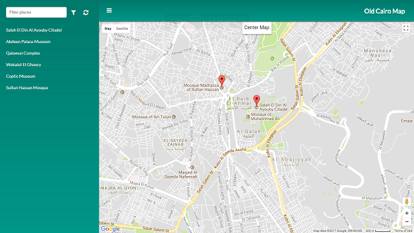

# Old Cairo Map

## Description
* This is a map built using google maps JavaScript api to mark several historical places in old Cairo.
* Each marker displays one of FourSquare users' qoute & ratings pinned to this place.
* This application is part of Udacity **Neighborhood Map** frontend nano degree project.
* You can access a working version at [Neighborhood Map](https://alia-adel.github.io/udacity-fend-neighorhood-map/)

## User Guide
1. The user opens `index.html` to view the map.
2. Click on the hamburger icon in the header to open the navigation.

## Code Walk-Through
1. Google maps javaScript api's url is imported in `index.html`
    1. `initMap()` function is passed as a parameter to load after calling google's api.
2. In `initMap()` function:
    1. A new instance is created from `google.maps.Map` with **Abdeen Palace Museum** as the center of the map & with zoom level of 15.
    2. New instance is created from `CenterControl` to create a custom control on the map to reset the view.
    3. `geoCodePlaces()` function is called which will do the following:
        1. Create a new instance from `google.maps.Geocoder`.
        2. Create a `Promise` call to:
            1. Loop on `oldCairoPlaces` array & geocode it to get its exact position & place details.
            2. Once all geocode calls return (either success or failure), knockout binding is done with `PlacesViewModel` call.
3. In `PlacesViewModel` the following will be executed:
    1. Create the following knockout `observables`:
       -------------------------------------------
        - `filterText` - To observe for the filter text that will be entered by the user.
        - `navHidden`  - Flag to hold if the navigation is shown or hidden.
        - `selectedPlace` - Track the currently selected place object.
        - `myPlaces` - Observable array for all my places
    2. Create the following functions:
       -------------------------------
        - `createPlaceMarker` - Given a title, latitude & longtitude, it adds a marker on the map
            - Adds an onClick event on each marker to do the following:
                - Bounce the marker.
                - Set map's center to the markers latitude & longtitude.
                - Set the currently selected place observable `selectedPlace` to the one that belongs to the marker.
                - Calls `loadInfoWindow` function which will do the following:
                    - Load data from `#info-window` div (where `#info-window` is bound to `selectedPlace` data).
                    - Open the infoWindow on the clicked marker.
        - `getMarkerPlace` - Given a marker, it will return the equivelant `Place` object by looping over `myPlaces` observable array.
        - `changeNavigationStatus` - Adds a css class **hidden** on `#app-nav` when the hamburger icon is clicked.
        - `filterPlaces` - When the user enters his filter text & clicks on the filter icon this function will do the following:
            - Copies `myPlaces` observable array to a temp array.
            - Loops through the temp array & check if the place name matches the entered filter text.
            - Every non matched place will be removed from `myPlaces` observable array.
            - `updateMarker` function will be called to remove the un matched markers from the map.
        - `resetPlaces` - When the user clicks on the refresh icon beside the filter icon:
            - `myPlaces` observable array will reset to have all places.
            - `filterText` observable value will be set to empty.
            - Loop over all info windows & close them.
            - Loop over all places in `myPlaces` observable array & set their selected status to **false**.
            - Reset the map position to **Abdeen Palace Museum** & reset the zoom to 15.
        - `triggerPlaceClickActions` - When the user clicks on a place in the left navigation the following will happen:
            - Hide the navigation.
            - Set `selectedClassName` to **true** for the place clicked & to **false** for the rest.
            - Set the observable `selectedPlace`to the place selected.
            - Bounce the marker.
            - Set map's center to the markers latitude & longtitude.
            - Calls `loadInfoWindow` function which will do the following:
                - Load data from `#info-window` div (where `#info-window` is bound to `selectedPlace` data).
                - Open the infoWindow on the clicked marker.
    3. Do the following actions:
       -------------------------
        - Loop on `myPlaces` observable array & on each place do the following:
            - Call `createPlaceMarker` to add the marker on the map.
            - Load FourSquare data for this place by calling `loadFourSquarePlaceInfo` function.

## Technical
### Frameworks
The following frameworks are used in this application:
- Knockout
- jQuery

### APIs
The following frameworks are used in this application:
- Google Maps JavaScript API
- [Google Places' Geocoding API](https://developers.google.com/maps/documentation/javascript/examples/geocoding-simple)
- [FourSquare Venue Search API](https://developer.foursquare.com/docs/api/venues/search)

### Technical Contribution
- [Google Maps Custom Controls' Example](https://developers.google.com/maps/documentation/javascript/examples/control-custom) is used to add a custom control on the map to reset the view to old Cairo's center.

